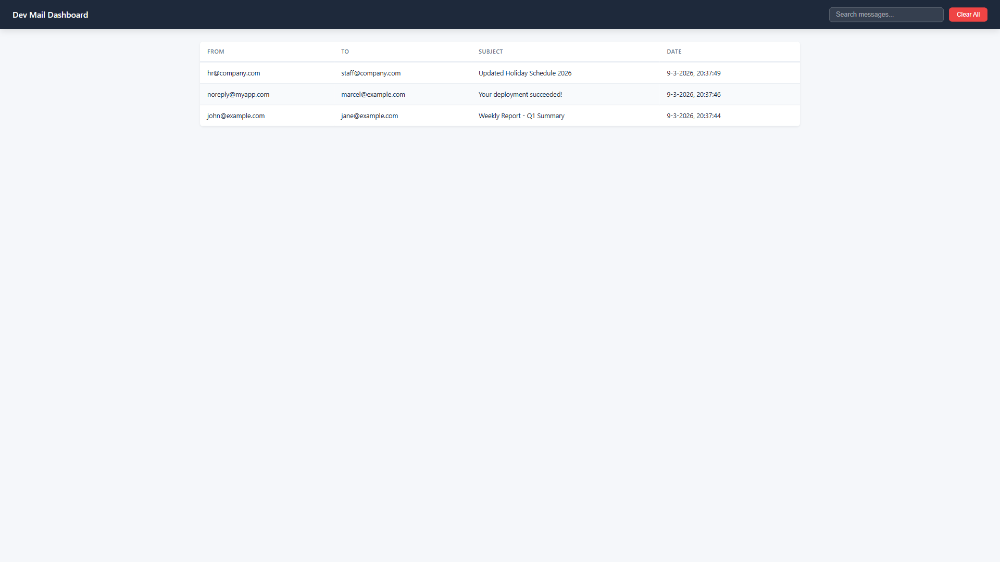

# MailPeek

A NuGet package that provides an **in-memory fake SMTP server** with a **real-time web dashboard** for ASP.NET Core applications. Think Hangfire, but for emails.

Perfect for local development and testing — capture emails your app sends without configuring a real mail server.



## Features

- **Fake SMTP server** — Receives emails on a configurable port, no external mail server needed
- **Real-time dashboard** — Messages appear instantly via SignalR
- **Full MIME support** — HTML/text bodies, attachments, CC/BCC, headers (powered by MimeKit)
- **Responsive UI** — Works on desktop, tablet, and mobile
- **Dark/light theme** — Respects your OS `prefers-color-scheme` setting
- **Hangfire-style DX** — Two lines of code to set up
- **Extensible auth** — Plug in your own authorization filter (OAuth, Azure AD, cookie auth, etc.)
- **Testable** — Inject `IMessageStore` in your tests to assert emails were sent
- **Zero frontend toolchain** — All assets embedded in the DLL

## Quick Start

### 1. Install the package

```bash
dotnet add package MailPeek
```

### 2. Register services

```csharp
using MailPeek.Extensions;

var builder = WebApplication.CreateBuilder(args);

builder.Services.AddMailPeek(options =>
{
    options.Port = 2525;           // SMTP port to listen on
    options.MaxMessages = 1000;    // Max stored messages (FIFO eviction)
});

var app = builder.Build();

app.UseMailPeek(options =>
{
    options.PathPrefix = "/mailpeek";  // Dashboard URL (configurable)
    options.Title = "MailPeek";        // Custom page title
});

app.Run();
```

### 3. Point your app's SMTP settings to `localhost:2525`

```json
{
  "Smtp": {
    "Host": "localhost",
    "Port": 2525
  }
}
```

### 4. Open the dashboard

Navigate to `http://localhost:5000/mailpeek` to see received emails in real-time.

## Configuration

### MailPeekSmtpOptions

| Property | Default | Description |
|----------|---------|-------------|
| `Port` | `2525` | SMTP listen port |
| `Hostname` | `"localhost"` | SMTP server hostname |
| `MaxMessages` | `1000` | Max messages in memory (oldest evicted first) |
| `MaxMessageSize` | `10000000` | Max message size in bytes (10 MB) |

### MailPeekDashboardOptions

| Property | Default | Description |
|----------|---------|-------------|
| `PathPrefix` | `"/mailpeek"` | Dashboard URL prefix |
| `Authorization` | `[]` | Array of `IMailPeekAuthorizationFilter` |
| `Title` | `"MailPeek"` | Page title |

## Authorization

The dashboard supports extensible authorization via `IMailPeekAuthorizationFilter`:

```csharp
using MailPeek.Authorization;

public class MyAuthFilter : IMailPeekAuthorizationFilter
{
    public bool Authorize(MailPeekAuthContext context)
    {
        // Check claims, roles, policies — whatever your auth stack provides
        return context.HttpContext.User.Identity?.IsAuthenticated == true;
    }
}

// Register it
app.UseMailPeek(options =>
{
    options.Authorization = [new MyAuthFilter()];
});
```

Works naturally with OAuth, Azure AD, cookie auth, or any ASP.NET Core authentication middleware.

## Testing

Inject `IMessageStore` in your tests to assert that emails were sent:

```csharp
using MailPeek.Storage;

var store = serviceProvider.GetRequiredService<IMessageStore>();

// Send an email through your app's email service...

var messages = store.GetAll();
Assert.Single(messages);
Assert.Equal("user@example.com", messages[0].To.First());
Assert.Equal("Welcome!", messages[0].Subject);
```

## Dashboard Pages

| Page | Description |
|------|-------------|
| `/mailpeek` | Inbox — searchable message list with real-time updates |
| `/mailpeek` (detail) | Message detail — HTML preview, plain text, headers, attachment downloads |

### REST API

The dashboard exposes a REST API under `{prefix}/api/`:

| Method | Path | Description |
|--------|------|-------------|
| `GET` | `/mailpeek/api/messages` | List messages (paged: `?page=0&size=25&search=`) |
| `GET` | `/mailpeek/api/messages/{id}` | Message detail |
| `GET` | `/mailpeek/api/messages/{id}/html` | HTML body (for iframe) |
| `GET` | `/mailpeek/api/messages/{id}/attachments/{index}` | Download attachment |
| `DELETE` | `/mailpeek/api/messages/{id}` | Delete message |
| `DELETE` | `/mailpeek/api/messages` | Clear all messages |

## Tech Stack

- [SmtpServer](https://github.com/cosullivan/SmtpServer) — SMTP protocol handling
- [MimeKit](https://github.com/jstedfast/MimeKit) — MIME message parsing
- ASP.NET Core SignalR — Real-time dashboard updates
- Embedded HTML/JS/CSS — No frontend build toolchain required

## Requirements

- .NET 8.0 or .NET 9.0

## License

MIT
