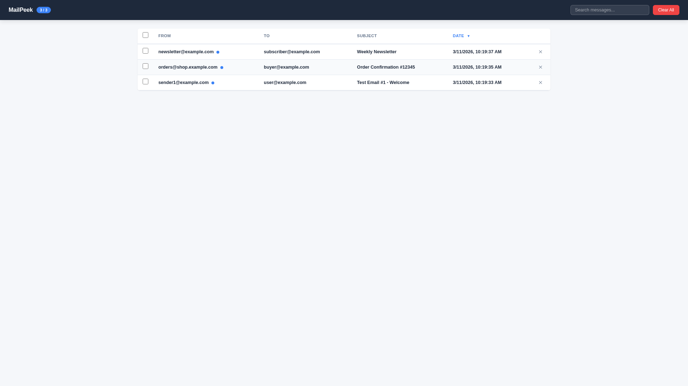
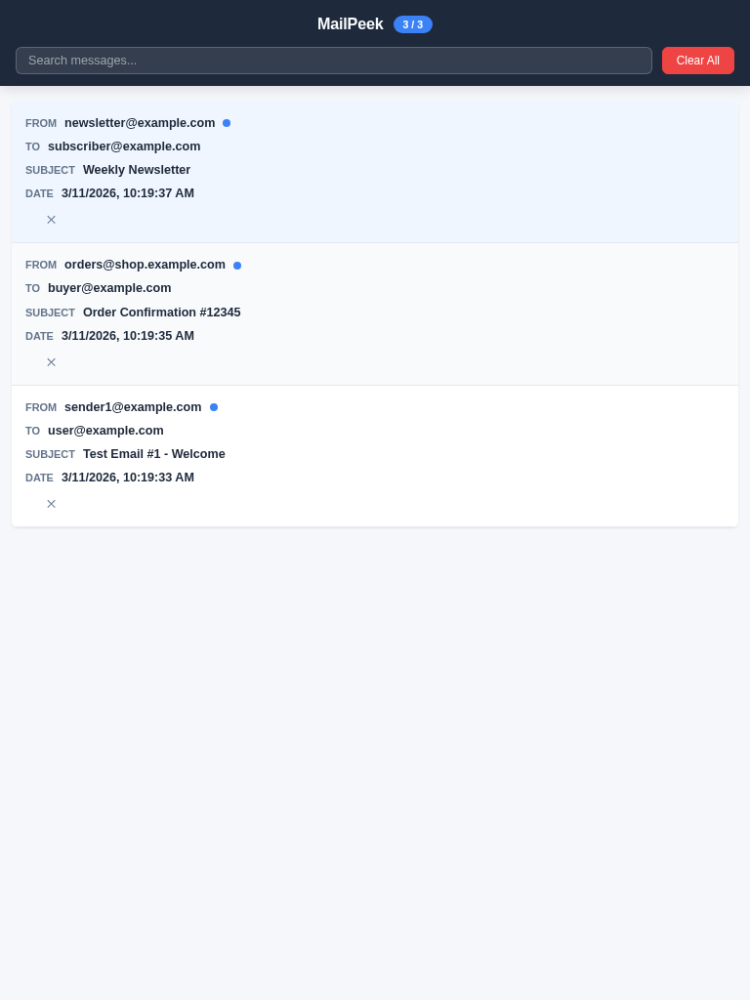
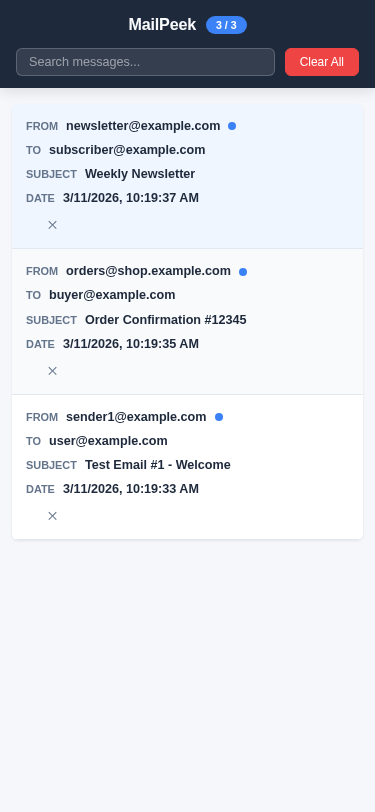
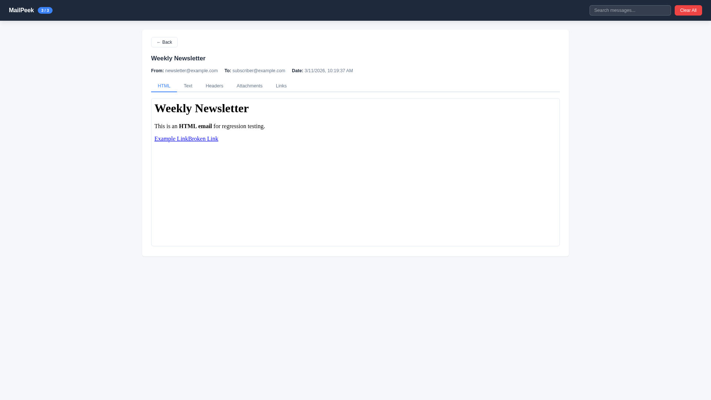
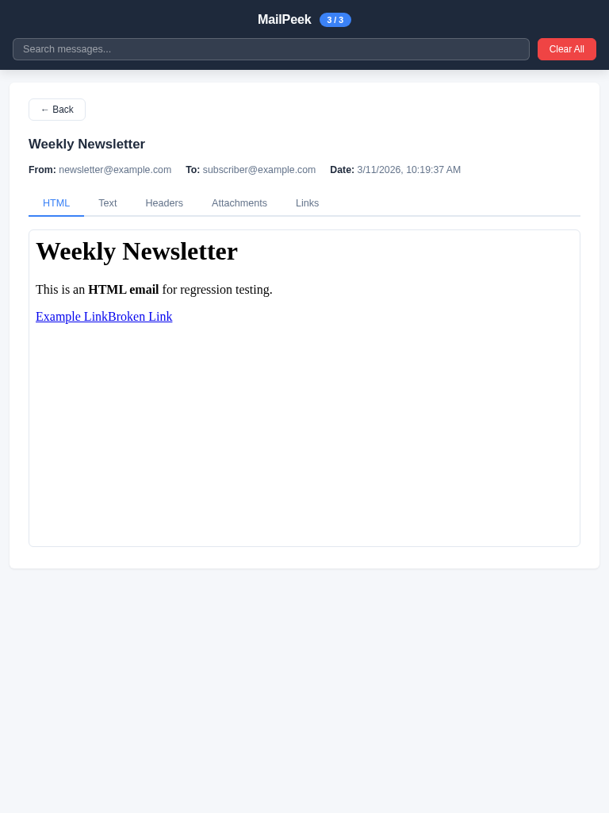
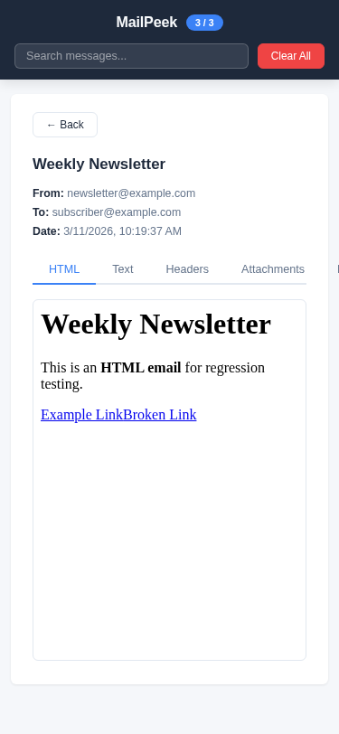
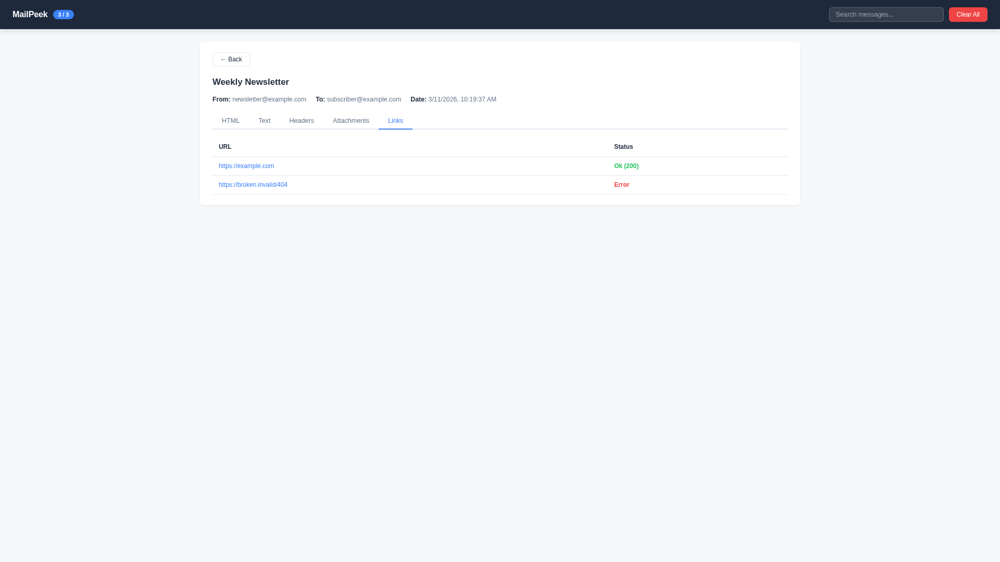

# Regression Test Report

## Summary

| Metric                 | Value                              |
|------------------------|------------------------------------|
| Date                   | 2026-03-11 11:15                   |
| Application URL        | http://localhost:5157/mailpeek     |
| Pages Tested           | 3 (Root, Inbox, Message Detail)    |
| Viewports Tested       | 3 (Desktop 1920x1080, Tablet 768x1024, Mobile 375x812) |
| Existing Tests Passed  | 72                                 |
| Existing Tests Failed  | 0                                  |
| Console Errors Found   | 1                                  |
| Network Errors Found   | 0                                  |
| Visual Issues Found    | 2                                  |
| Overall Status         | **WARN**                           |

---

## Existing Test Results

- **Framework:** xUnit 2.9.3 (.NET 9)
- **Command:** `dotnet test tests/MailPeek.Tests/MailPeek.Tests.csproj --verbosity normal`
- **Result:** 72 passed, 0 failed, 0 skipped (7.5s)

Test categories covered

- Extensions (ServiceRegistrationTests, ServiceCollectionExtensionsTests)
- Middleware (DashboardStaticFilesMiddlewareTests, DashboardApiMiddlewareTests)
- Hubs (MailPeekHubNotifierTests)
- SMTP (MailPeekSmtpMessageStoreTests)
- Storage (InMemoryMessageStoreTests)
- Models (StoredMessageTests)
- Services (LinkCheckerTests, PlusAddressTagExtractorTests, WebhookNotifierTests)
- Integration (EndToEndTests)

---

## Page-by-Page Results

### 1. Root Page (`/`)

**URL:** http://localhost:5157/

**Functional Checks:**
- Console errors: 1 (favicon.ico 404)
- Network errors: None (page itself returns 200)
- Structure: Plain text response, no HTML styling

**Screenshots:**

**Visual Evaluation:**
- Plain text page with no styling — this is expected behavior (simple status message)
- The `/mailpeek` link is not clickable (plain text, not hyperlinked)

**Severity:** Pass (informational page, not user-facing UI)

---

### 2. Inbox Page (`/mailpeek`)

**URL:** http://localhost:5157/mailpeek

**Functional Checks:**
- Console errors: 0
- Network errors: 0
- SignalR connection: Established successfully (WebSocket transport)
- Search: Working — filters messages by subject in real-time
- Read/unread status: Working — blue dot indicator, counter updates (3/3 → 2/3) after viewing a message
- Message count badge: Displays correctly (shows "unread / total")
- Sorting columns: From, Subject, Date are sortable (cursor indicates clickable)
- Select all checkbox: Present and functional
- Per-row delete buttons: Present (✕ buttons)

**Screenshots:**

| Viewport | Screenshot |
|----------|-----------|
| Desktop (1920x1080) |  |
| Tablet (768x1024) |  |
| Mobile (375x812) |  |

**Visual Evaluation:**

| Criteria | Desktop | Tablet | Mobile |
|----------|---------|--------|--------|
| Layout | Clean table layout, well-spaced columns | Card layout, good use of space | Card layout, appropriate for screen size |
| Spacing | Consistent padding, balanced whitespace | Good margins around cards | Adequate spacing |
| Typography | Readable font sizes, clear hierarchy | Good readability | Good readability |
| Color | Dark header, white body, blue accents for unread | Consistent with desktop | Consistent |
| Responsiveness | N/A | Table → card transition works well | Cards adapt well to narrow width |
| Completeness | All columns visible, badge shows counts | All fields visible in cards | All fields visible |
| Polish | Professional, clean appearance | Well-designed card layout | Clean, usable |

**Severity:** Pass

---

### 3. Message Detail Page (`/mailpeek` — detail view)

**URL:** http://localhost:5157/mailpeek (SPA — opened by clicking a message row)

**Functional Checks:**
- Back button: Working — returns to inbox
- HTML tab: Renders email HTML in sandboxed iframe
- Text tab: Displays plain text body correctly
- Headers tab: Shows MIME headers in table format
- Attachments tab: Present (no attachments in test email)
- Links tab: Working — shows link check results with Ok/Error status and color coding
- Compatibility tab: Not visible (hidden when no compatibility data — expected)
- Spam tab: Not visible (hidden when no spam analysis data — expected)

**Screenshots:**

| Viewport | Screenshot |
|----------|-----------|
| Desktop (1920x1080) |  |
| Tablet (768x1024) |  |
| Mobile (375x812) |  |
| Links Tab (Desktop) |  |

**Visual Evaluation:**

| Criteria | Desktop | Tablet | Mobile |
|----------|---------|--------|--------|
| Layout | Clean layout with metadata, tabs, and iframe | Adapts well, iframe fills width | Good vertical stacking |
| Spacing | Good spacing between sections | Consistent | Adequate |
| Typography | Clear subject heading, readable metadata | Good | Good |
| Color | Link status colors (green Ok, red Error) clear | Consistent | Consistent |
| Responsiveness | N/A | Good adaptation | **Tabs clipped — "Links" tab not fully visible** |
| Completeness | All elements present | All elements present | Tab bar truncated |
| Polish | Professional appearance | Clean | Tab overflow issue reduces polish |

**Severity:** Minor (tab overflow on mobile)

---

## Recommendations

### Minor Issues

1. **Tab bar overflow on mobile (375px)** — The tab navigation in the message detail view clips the "Links" tab off-screen at mobile viewport width. The tabs should either wrap to a second line, scroll horizontally with visible scroll indicators, or use a dropdown/overflow menu for narrow screens.

2. **Favicon 404 on root page** — The root page (`/`) returns a 404 for `/favicon.ico`. The dashboard at `/mailpeek` uses a data URI favicon which works fine, but the root page doesn't serve one. Consider adding a favicon middleware or ignoring this for the plain-text root endpoint.

### Suggestions

3. **Root page `/mailpeek` link not clickable** — The root page shows "Dashboard at /mailpeek" as plain text. Consider making this a hyperlink for convenience.

4. **"Actions" column header label** — The desktop table header shows "Actions" with `sr-only` class, which is correct for accessibility. Verified it's hidden visually and present for screen readers.

---

## Test Environment

- **OS:** Windows 11 Pro
- **Runtime:** .NET 9.0
- **Browser:** Chromium (via Playwright MCP)
- **SMTP Port:** 2525
- **Web Port:** 5157
- **Test data:** 3 emails sent via Python smtplib with HTML+text multipart bodies and test links
